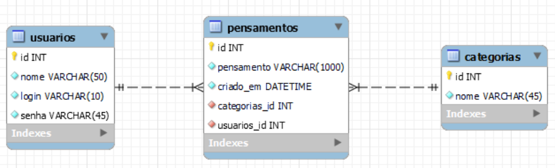

# Recuperação Final

Professor: João Eduardo Montandon

Data de entrega: 18/02/2022 às 23h59

## Meu Querido Diário

O diagrama relacional abaixo representa o schema do MeuQueridoDiario, proposta de um sistema web onde seus usuários poderão registrar seus pensamentos diariamente.

Você ficou responsável por implementar o MVP do produto.
Essa versão deverá conter as seguintes funcionalidades:
1. Registro de usuário
2. Login de usuário
3. Adicionar um novo pensamento
4. Visualização dos pensamentos adicionados

Você deverá fazer uso dos conceitos de PHP e banco de dados vistos ao longo da disciplina, incluindo:
* Formulários
* Sessões e Cookies
* Classes e Objetos
* Banco de dados relacional
* SQL

## Entrega e Apresentação

O trabalho deverá ser entregue por meio de pull requests no GitHub.

Além disso, o aluno deverá apresentar o trabalho em execução, demonstrando as funcionalidades implementadas bem como comentar as dificuldades encontradas no desenvolvimento do trabalho.
Essa apresentação poderá ser realizada ao vivo, em horário combinado previamente com o professor, ou gravada por meio de um vídeo com duração entre 5 e 7 minutos.
